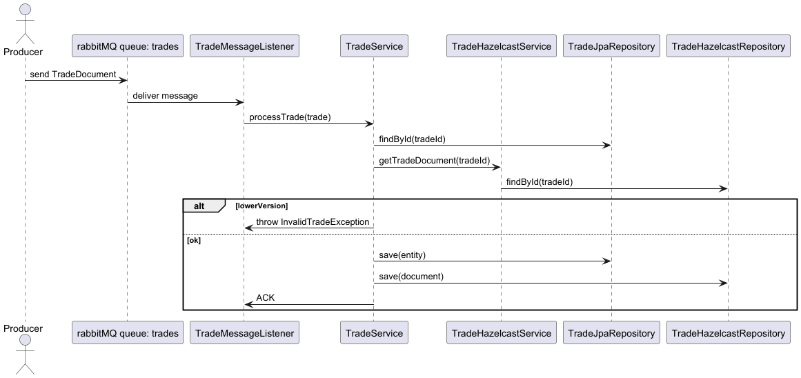
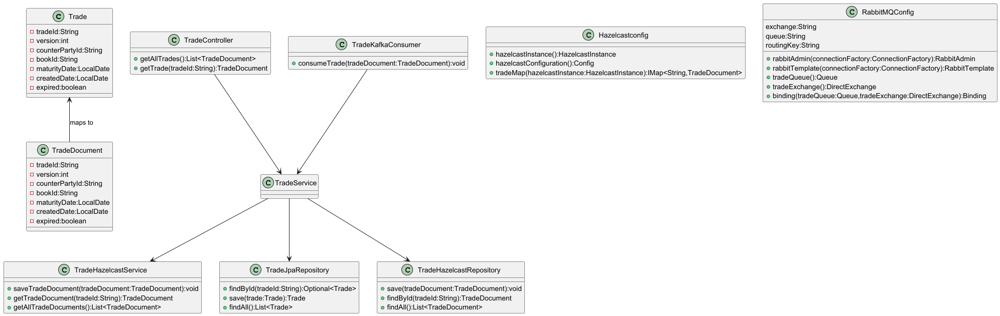

# Trade Store
Trade Store is a Spring Boot application that ingests trades via RabbitMQ, enforces versioning and maturity validations, and stores them in both SQL and NoSQL databases. It includes automated expiry handling, comprehensive TDD tests, and a CI/CD pipeline with vulnerability scanning

# Trade Store Sequence Diagram

# Trade Store Class Diagram

